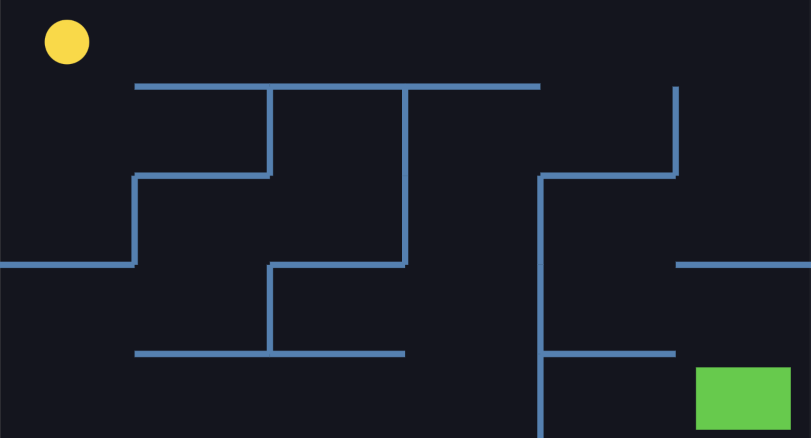

# Maze

Generate a maze game that a user can control the ball to reach the goal colored in green. Object rendering and animation are created with `Matter.js`.

## Movement

Use WASD keys to move the ball and solve the challenge!

## Configuration

In `index.js`, you can configure maze's complexity.

1. Change `cellsHorizontal` for number of columns
2. Change `cellsVertical` for number of rows
